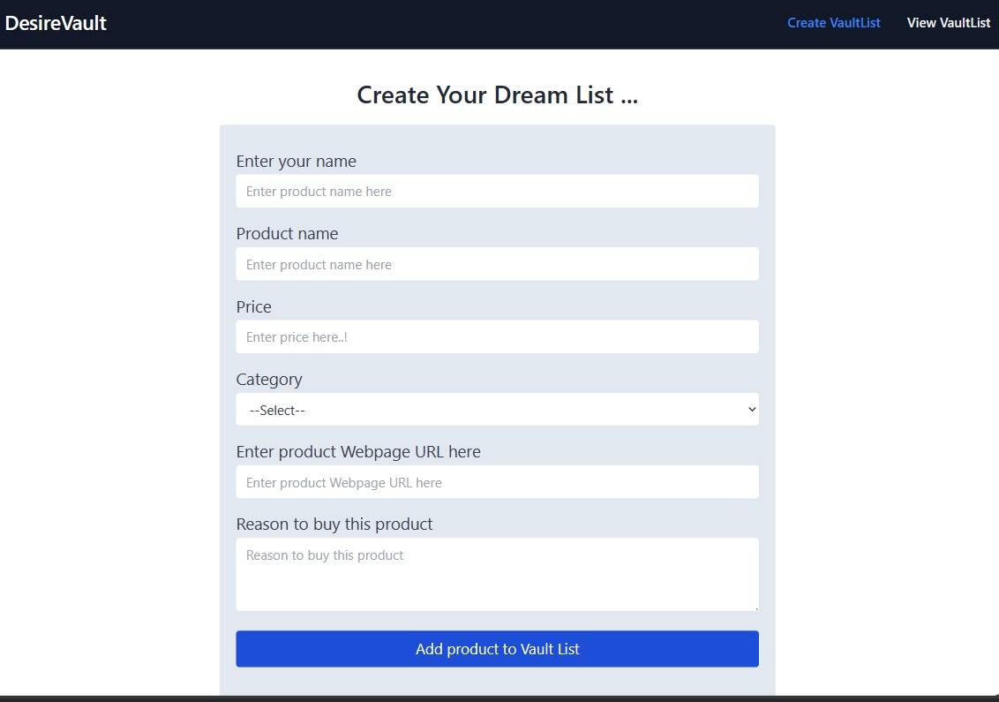
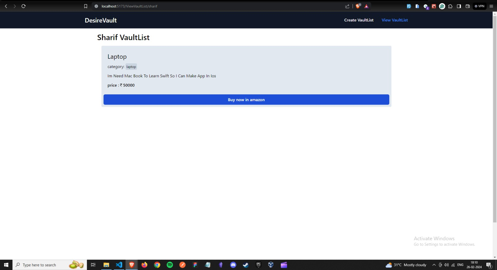

# Desire-Vault - Product Watchlist App

## Table of Contents

- [Project Title](#project-title)
- [Description](#description)
- [Problem](#problem)
- [Solution](#solution)
- [Demo](#demo)
- [Features](#features)
- [Technologies Used](#technologies-used)
- [How to Use](#how-to-use)
- [Firebase Setup](#firebase-setup)
- [Team Members](#team-Members)
- [Contributing](#contributing)
- [License](#license)
- [Acknowledgments](#acknowledgments)

## Project Title

DesireVault

## Description

DesireVault is a collaborative product watchlist app developed for a hackathon project. It allows users to create, manage, and share lists of products they desire to purchase or keep track of. The app is built with React.js for the frontend, Tailwind CSS for styling, and Firebase for real-time collaborative features. Users can add products to their watchlists, mark them as purchased, and collaborate with others on shared lists.

## Problem

Many people often find themselves interested in various products, whether it's books, gadgets, or household items, but struggle to keep track of them all. Traditional methods like writing down lists or saving bookmarks can be cumbersome and disorganized. Additionally, sharing these lists with others for recommendations or collaborative shopping can be challenging.

## Solution

DesireVault provides a solution to these problems by offering a user-friendly and collaborative product watchlist app. Users can easily create, manage, and share lists of desired products, making it effortless to keep track of items they want to purchase or explore further. With real-time collaborative features powered by Firebase. With Desire Vault, users can stay organized, discover new products, and streamline their shopping experience.

## Screenshot

  
  
  

## Demo

[Live Demo](https://desire-vault.vercel.app/) 

## Features

- Create, view and delete watchlists of desired products
- Collaborate with others by sharing watchlists and making updates in real-time
- Mark products as purchased and keep track of their status
- User-friendly interface with responsive design for seamless usability on various devices

## Technologies Used

- HTML
- CSS (Tailwind CSS)
- React.js
- Firebase (Firestore and Authentication)

## How to Use

1. Clone the repository to your local machine.
2. Navigate to the project directory.
3. Install dependencies using `npm install`.
4. Set up Firebase for the app (see [Firebase Setup](#firebase-setup) section for instructions).
5. Start the development server with `npm start`.
6. Access the application in your web browser at `http://localhost:3000`.
7. Sign up or log in to start creating and managing your watchlists of desired products.

## Firebase Setup

1. Sign in to the Firebase Console (https://console.firebase.google.com/) with your Google account.
2. Create a new Firebase project.
3. Set up Firebase Authentication and Firestore for your project.
4. Obtain your Firebase configuration settings (apiKey, authDomain, projectId, etc.).
5. Replace the placeholder values in your React app's Firebase configuration file (`src/firebase/firebase.js`) with your actual Firebase configuration settings.
6. Set up Firestore rules to allow read and write access to your watchlist collections.
7. Your Desire Vault app is now ready to use Firebase for real-time collaborative features.

## Team Members

- [khaja sharif](https://github.com/sharif-22/)
- [kishorekumar k](https://github.com/kishorekumar-kp)
- [Swetha Ramesh](https://github.com/SwethaDSalvatore/)

## Contributing

Contributions are welcome! If you'd like to contribute to Desire Vault, please fork the repository, make your changes, and submit a pull request. Be sure to follow the project's coding standards and guidelines.

## License

[MIT](./LICENSE.md)

## Acknowledgments

I want to express my gratitude to all the [Hackerthon Mentors](https://www.youtube.com/live/EjINeXPxjtw?si=xEGLy5UMvKvDXLGE) for the invaluable guidance and support throughout the development of this project. Their insights and feedback have significantly contributed to the success of this endeavor. Special thanks to all my Colleague for their collaborative efforts and constructive suggestions.

As I continue to advance in my programming journey, the skills acquired and lessons learned from this project will serve as a solid foundation for future endeavors.

--- 
